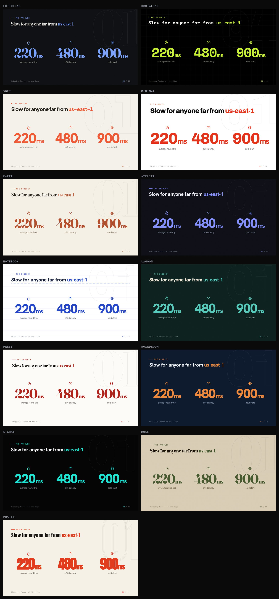
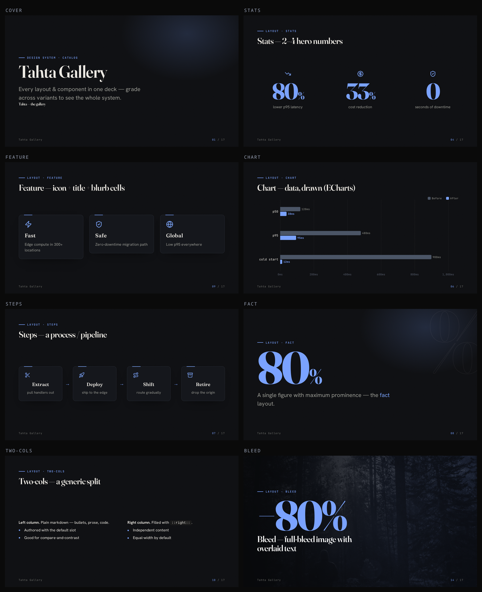

<h1 align="center">tahta</h1>

<p align="center"><b>A design system for <a href="https://sli.dev">Slidev</a>.</b><br>
Tokens, components, and patterns — so a deck is something you <i>assemble</i>, not style.</p>

<p align="center"><code>npm i slidev-theme-tahta</code></p>

<p align="center"><a href="https://tahta.cagdas.io">tahta.cagdas.io</a> — live explorer (every layout × every variant) · used in production by <a href="https://tela.cagdas.io">tela</a> as its deck theme.</p>

<p align="center"></p>

<p align="center"><em>One deck, thirteen variants — one line changed. Not a recolor: different typefaces, shapes, textures, density, and motion.</em></p>

---

Most Slidev themes are a stylesheet and some layouts. **Tahta is a design system**: a token foundation, a component library with a published contract, a layout kit, generated docs, and a test that enforces the system's own rules. You author decks from **declarative frontmatter** — no CSS, no grids, no layout HTML — and reskin everything by switching a variant.

What makes it a system, not a theme:

- **Foundations as data.** A 3-tier token layer ([`tokens.json`](packages/theme/tokens.json)) — primitives → semantic → variant bundles. Components read *only* semantic tokens, so a variant is a remap. One `--accent` derives the whole palette (tints, shades, chart series) via OKLCH.
- **A published contract.** [`layouts.json`](packages/theme/layouts.json) (every layout + field) and [`variants.json`](packages/theme/variants.json) ship in the package; [`AGENTS.md`](packages/theme/AGENTS.md) is *generated* from them.
- **Components & patterns.** `Stat`, `Plot` (ECharts), `Callout`, `Badge`, `Icon` (Lucide, bundled), `Reveal`, `Fit` + 30 layouts — all variant-aware. Semantic `good/warn/bad/info` roles; `themeConfig.lang` for locale casing (Turkish `i→İ`).
- **Quality is enforced, not hoped for.** `npm test` gates a **token-contract** (no hardcoded values) and **WCAG-AA contrast** for every variant; CI renders every layout across every variant.
- **Variants are the proof.** `themeConfig.variant` — 13 complete styles (6 dark / 7 light) swapping type, shape, texture, density, motion, and palette. *That's* the one-liner — a consequence of the token system, not the pitch.

## Variants

| | scheme | type | shape | feel |
|---|---|---|---|---|
| **editorial** *(default)* | dark | Fraunces serif + Hanken | hairline, grain | refined keynote |
| **brutalist** | dark | Space Mono | hard edges, grid | technical / raw |
| **soft** | light | Plus Jakarta | rounded, soft shadow | friendly / product |
| **minimal** | light | Archivo, heavy | Swiss whitespace | high-contrast editorial |
| **paper** | light | Fraunces serif | warm cream, grain | warm editorial |
| **atelier** | dark | Hanken, gradient titles | cool, refined | studio / premium |
| **notebook** | light | Hanken, bold | ruled paper, dashed rules | playful-clean |
| **lagoon** | dark | Hanken, heavy | teal + pastel role-cards, rounded | moody / premium |
| **press** | light | Fraunces serif | B&W, hairline, sharp | editorial magazine |
| **boardroom** | dark | Hanken | navy + orange, conservative | corporate / trust |
| **signal** | dark | Hanken, heavy | true black + electric, glow | launch / bold |
| **muse** | light | Fraunces serif | muted stone, cream cards, grain | intellectual / restraint |
| **poster** | light | Anton condensed | cream, thick rules, hot accent | loud / athletic |

Machine-readable contracts ship in the package: [`variants.json`](packages/theme/variants.json) (the table above as data) and [`layouts.json`](packages/theme/layouts.json) (every layout + field + component) — `AGENTS.md` is generated from them.

```yaml
themeConfig:
  variant: brutalist
  accent: '#c8f135'   # optional — override just the brand color
```

## Quick start

```bash
npm i slidev-theme-tahta echarts        # echarts only if you use the chart layout
```

```yaml
---
theme: slidev-theme-tahta
title: My Talk
themeConfig: { variant: editorial }
layout: cover
kicker: Team · 2026
subtitle: A one-line promise
---
```

## Write slides by filling fields

Every layout reads structured frontmatter — a full stats slide is nine lines and zero markup:

```yaml
---
layout: stats
kicker: The numbers
title: What actually changed
stats:
  - { value: 80, unit: "%", label: lower p95 latency }
  - { value: 33, unit: "%", label: cost reduction }
  - { value: 0, label: seconds of downtime }
---
```

### Layouts

**Keynote / pitch** — `cover` · `lead` · `section` · `default` · `statement` · `bigtype` · `quote` · `stats` · `fact` · `metric` · `compare` · `chart` · `steps` · `feature` · `timeline` · `logos` · `code` · `two-cols` · `image` · `showcase` · `bleed` · `embed` · `end`

**Teaching / technical** — `agenda` · `define` · `columns` · `panels` · `reference` · `vs` · `code-explain` (+ `<Kbd>` / `<Terminal>` / `<FileTree>`)

Charts do `bar · line · area · donut` (ECharts), with a categorical palette derived from your one accent. `code` supports Magic Move. Long bodies auto-fit to the frame. `<em>word</em>` in a title sets italic accent emphasis.

<p align="center"></p>

Full per-layout reference: [`packages/theme/AGENTS.md`](packages/theme/AGENTS.md).

## Theming goes deep

Three levels, all declarative:

1. **Variant** — `themeConfig.variant` swaps the whole style bundle.
2. **Accent** — `themeConfig.accent` overrides the single brand color.
3. **Tokens** — `packages/theme/styles/tokens.css` is a 3-tier system (primitives → semantic → variant bundles). Components read only semantic tokens, so a new `:root[data-variant='…']` block restyles everything.

See [`docs/design-system.md`](docs/design-system.md).

## Repo

```
packages/theme/   slidev-theme-tahta — the design system (tokens · variants · layouts · components)
packages/grade/   @zcag/tahta-grade — visual-grading CLI used to develop the theme
examples/edge/    a deck authored entirely in frontmatter
examples/gallery/ every layout + component, in one deck
docs/             design-system.md + generated images
```

## Developing tahta

The theme is the project; the tooling exists to build it well. `packages/grade` (`@zcag/tahta-grade`) is the inner loop — it exports every slide to PNG, flags blank/broken/regressed/overflowing slides, and serves a side-by-side report with a tab per variant.

```bash
npm install
npm run dev        # live-edit the example deck
npm run grade      # export + grade the example across all four variants, serve the report
npm run assets     # regenerate the README images from source
```

Editing the system, the loop is: change a token → `npx @zcag/tahta-grade examples/gallery/slides.md --variants editorial,brutalist,soft,minimal --watch` → see every slide in every variant update, with regressions flagged. Details in [`packages/grade/README.md`](packages/grade/README.md).

## License

MIT © Cagdas Salur
