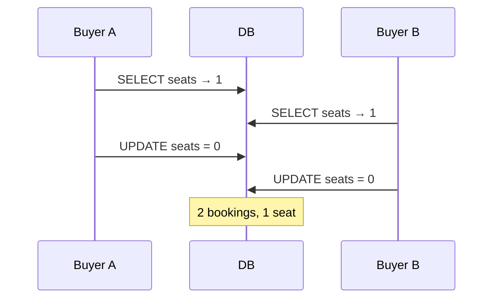
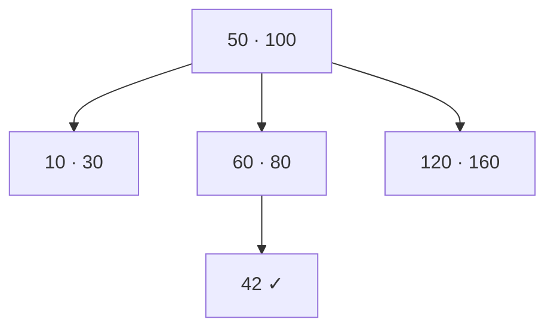
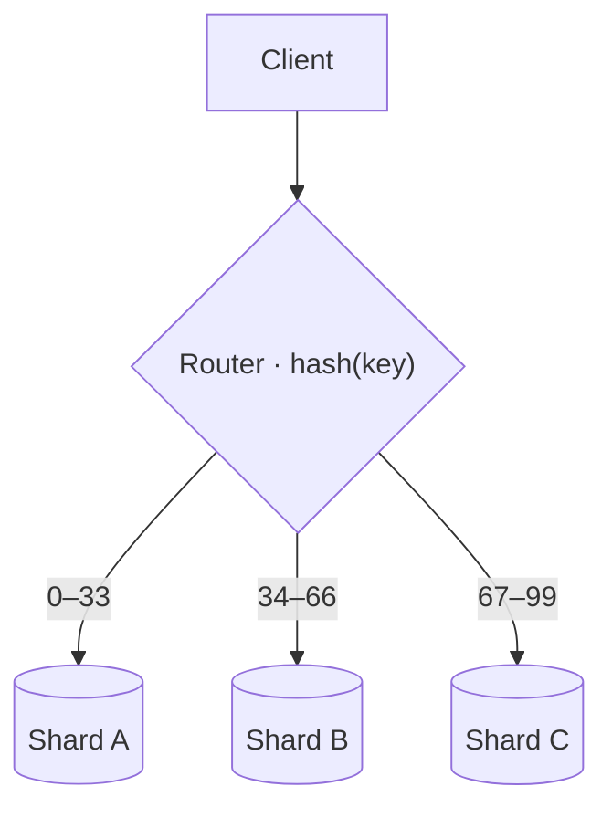
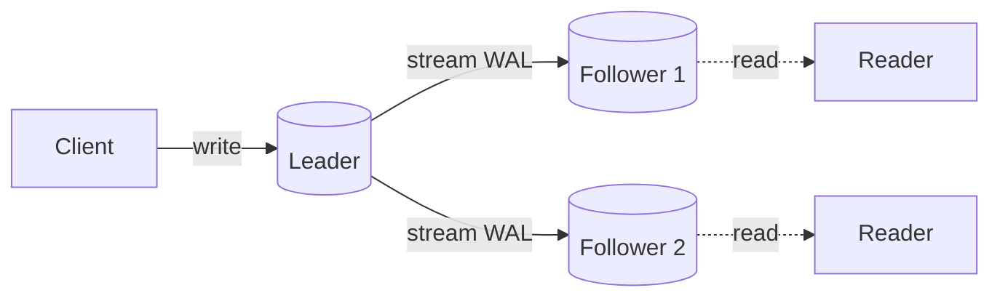

---
layout: agenda
kicker: The map
title: What we'll cover
items:
  - { topic: Foundations, desc: "ACID · isolation · the seat race" }
  - { topic: Indexes & storage, desc: "B-trees · row vs column" }
  - { topic: Scale, desc: "sharding · replication" }
---

---
layout: section
index: "01"
kicker: Part one
title: Foundations
---

---
layout: diagram
kicker: Concurrency
title: Two transactions, one seat
note: Without isolation both reads see <strong>1</strong> — and both writes win.
---

---
layout: define
kicker: The core guarantee
term: ACID
definition: A transaction is all-or-nothing and survives crashes.
points:
  - "Atomicity — every step commits, or none"
  - "Isolation — concurrent txns don't see each other's partial state"
---

---
layout: section
index: "02"
kicker: Part two
title: Indexes & storage
---

---
layout: define
kicker: Indexes
term: Big-O
definition: How lookup cost grows with rows $n$.
points:
  - "Full scan — $O(n)$"
  - "B-tree — $O(\\log n)$: ~3 hops in a billion rows"
---

---
layout: diagram
kicker: Index
title: A B-tree lookup
aside: under the hood
note: Find <strong>42</strong> in ~3 hops, not a full scan.
---

---
layout: default
kicker: Storage layout
title: A column store reads one column
---

<Grid :data="[['id','name','age','city'],['1','Ada','36','London'],['2','Lin','29','Berlin'],['3','Sam','41','Oslo']]" head highlight="col:2" />

A row store keeps each record together; a column store keeps each <em>column</em> together — so an aggregate over <strong>age</strong> reads only the highlighted cells.

---
layout: section
index: "03"
kicker: Part three
title: Scale
---

---
layout: diagram
kicker: Scale
title: Sharding by hash
note: The router sends each key to one shard; cross-shard queries are the cost.
---

---
layout: diagram
kicker: Replication
title: One leader, many followers
note: Reads fan out; replication lag between them is the whole game.
---

---
layout: statement
kicker: The takeaway
title: There's no <em>best</em> database — only trade-offs you chose on purpose.
---

---
layout: end
title: Thanks
subtitle: Questions welcome
---
